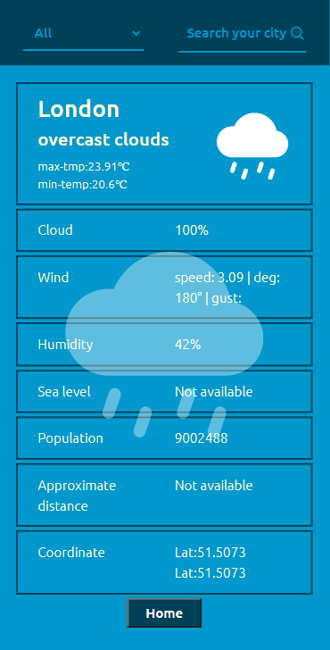

# Your daily weather

> This app enables users to get instant Information regarding weather conditions. If you share your location, it will fetch the top 10 cities near you and all the weather detail for each.

> you can also search for any city in the world and get the detail. It makes use of 3 different APIs. To fetch data, map coordinates, and locate your area and cities near you.

## Built With

- JavaScript
- React
- Redux
- API Gateway

## Screenshots

### Mobile

</img>
</img>

### Desktop

</img>

## Live Demo

[Go Live](https://my-city-weather-app.netlify.app/) 😎

## Getting Started

1. Open [dev branch](https://github.com/Tadesse-Alemayehu/weather-now)
2. Open VSCode or terminal and navigate to the folder where you would like to clone the project.
3. Type "pwd" to see your working directory.
4. [clone repository](https://github.com/Tadesse-Alemayehu/weather-now)

```bash
$ git clone https://github.com/Tadesse-Alemayehu/weather-now
```

5. Run

```bash
  $ npm install # to install required packages
  $ npm run start # to start the website on a local server
```

6. Enjoy 😎

## Author 👱‍♂️

👤 **Tadesse Alemayehu**

- GitHub: [@Tadess-Alemayehu](https://github.com/Tadesse-Alemayehu)
- Twitter: [@TadesseWebDev](https://twitter.com/TadesseWebDev)
- LinkedIn: [Tadesse Alemayehu](https://www.linkedin.com/in/tadesse-alemayehu-60141a221/)

## Show your support

Give a ⭐️ if you like this project!

## Submit an issue

[Issue page](https://github.com/Tadesse-Alemayehu/weather-now/issues)

## Acknowledgments

- [Nelson Sakwa](https://www.behance.net/sakwadesignstudio) for the initial design.
- Microverse for amusing learning resources.
- Microverse code reviewers.
- You! 😄 yes you... for visiting.

## 📝 License

LICENCED UNDER [MIT License](LICENSE)
